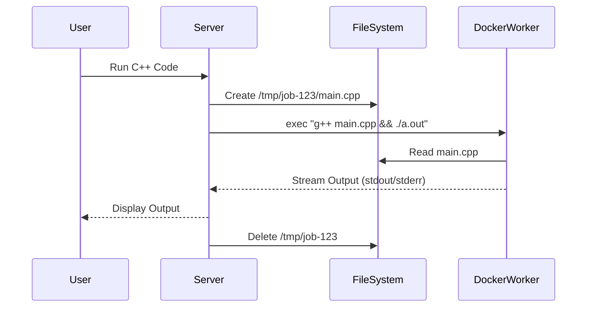

Live Demo:  https://code-collab-vz38.onrender.com

# Code Sync - Realtime Collaborative Code Editor with Remote Execution


**Code Sync** is a powerful real-time code collaboration tool that allows multiple users to edit code simultaneously in the same room. It features a robust **Remote Code Execution Engine** capable of compiling and running Python, JavaScript, C++, and Java code securely using Docker containers.

## 🚀 Key Features

-   **Real-time Collaboration**: Seamless multi-user editing with sub-millisecond latency using `Socket.io`.
-   **Multi-Language Sandbox**:
    -   **Python & JavaScript (Node.js)**: Instant execution via streams.
    -   **C++ & Java**: Full compilation and execution support using a persistent worker architecture.
-   **Security**: Code execution is fully isolated inside Docker containers to prevent malicious activity.
-   **Instant Output**: Real-time stdout/stderr streaming to the frontend console.
-   **Syntax Highlighting**: Dynamic editor modes based on selected language.

---

## 🏗️ Architecture Deep Dive

This project goes beyond simple collaborative editing by implementing a **Compiler-as-a-Service** architecture.

### The Problem with C++ & Java
Interpreted languages like Python can be piped directly into a process. However, compiled languages (C++/Java) require a **Filesystem Lifecycle**:
1.  Code must be written to a physical file (`main.cpp` / `Main.java`).
2.  The file must be compiled into a binary or bytecode (`g++` / `javac`).
3.  The artifact must be executed.
4.  All temporary files must be cleaned up to prevent leaks.

### Our Solution: Persistent Worker + Volume Mounting
Instead of spawning a new container for every request (which is slow), we use a **Persistent Worker Container** strategy.

1.  **Persistent Worker**: A single "Monolithic" Docker container (`code_collab_worker`) runs in the background, pre-loaded with GCC, JDK, Python, and Node.js.
2.  **Volume Mounting**: When a user runs code, the backend creates a unique, isolated temporary directory on the **Host OS** (`/tmp/uuid/`).
3.  **Fast Execution**: The backend writes the user's code to this directory and uses `docker exec` to run the compile chain inside the worker container.
    -   *Example C++ Command*: `g++ /app/temp/job1/main.cpp -o output && ./output`
4.  **Zero Latency**: Since the container is already running, there is **zero cold-start time**. Compilations happen instantly.



---

## 🛠️ Tech Stack

-   **Frontend**: React.js, Socket.io-client, CodeMirror
-   **Backend**: Node.js, Express, Socket.io
-   **Infrastructure**: Docker, Google Cloud Platform (Compute Engine)

---

## 📦 Installation & Setup

### Prerequisites
-   Docker installed and running.
-   Node.js v14+.

### 1. Clone the repository
```bash
git clone https://github.com/your-username/code-sync.git
cd code-sync
```

### 2. Setup the Worker Container
We use a custom Docker image that contains all necessary compilers.
```bash
# Build the image (this installs GCC, Python, Node, JDK)
docker build -t code_collab_image .
```

### 3. Install Dependencies
```bash
npm install
```

### 4. Run the Server
```bash
# This starts the backend AND builds the frontend
npm start
```
Open [http://localhost:5000](http://localhost:5000) to view it in the browser.

---

## ☁️ Deployment (GCP)

This project is deployed on **Google Cloud Compute Engine** to leverage the raw Docker socket for execution.

*Note: Deployment on PaaS platforms like Render or Vercel is NOT supported because they block the `docker` command required for the compiler engine.*


